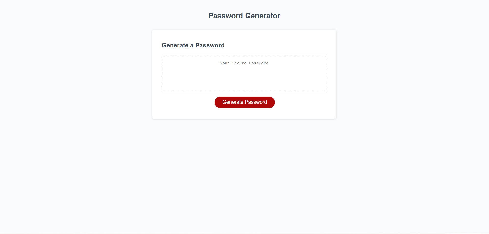

# Password Generator Starter Code

## Description
The purpose of this project was to create with JavaScript a password generator. In the code there is first variables of uppercase, lowercase, special characters, and numbers, these are selectable criteria for passwords. The final application is used as a random password generator within user selected criteria.

## Screenshot

## Website
https://kaylommy.github.io/kaylommy-module-3-challenge/

## Note/Contributors

I had worked on this project with Michael Freeman.
